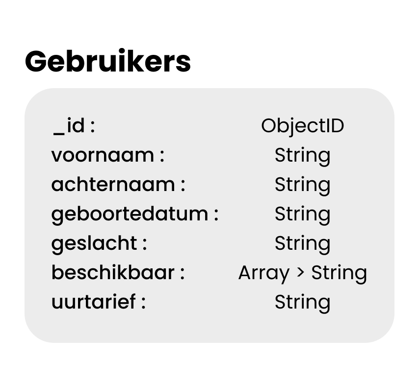

# 

## 🖤 ZoekOppas
ZoekOppas is een matching applicatie die het mogelijk gaat maken om een oppas te vinden voor uw kind! 

## 🛠 Feature
Als main feature heb ik gekozen om een filter te maken. Deze zorgt ervoor dat je een oppas kunt vinden die aan jou eisen voldoet. Je kunt de filter gebruiken door naar home te navigeren en rechtsboven op filter te klikken. Vervolgens vul je de filter in zoals jij wilt en zal de app gaan zoeken naar oppassen in de database.

Als extra feature heb ik het ook mogelijk gemaakt om een oppas toe te voegen. Zo kan ik zelf makkelijk nieuwe data toevoegen in de database, en controleren of de filter goed werkt. Deze functie zou later in het project verandert kunnen worden naar een login/registratie functie.

## ⚙️ Installeren
Clone de repository
```
git clone https://github.com/maxvl3/blok-tech.git
```

Installeer de packages
```
npm install
```

Start de app
```
npm start
```

## 📂 Database
De app maakt gebruik van een MongoDB Atlas database en hierin worden alle oppassen opgeslagen.<br>
De database structuur ziet er als volgt uit:<br>


## 📄 Licentie
Er wordt gebruik gemaakt van de [MIT](https://github.com/maxvl3/blok-tech/blob/main/LICENSE) licentie binnen dit project.

## ℹ️ Handige info
Naam: Max van Liempdt<br>
Mail: max.van.liempdt@hva.nl<br>
Studentnummer: 500849046